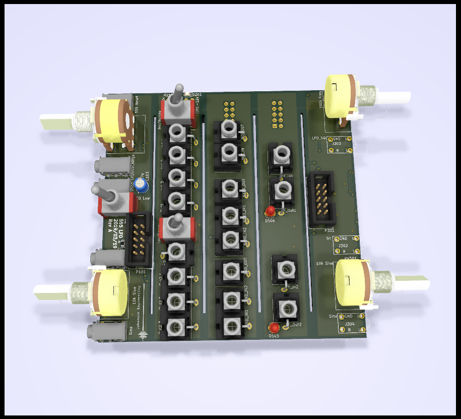
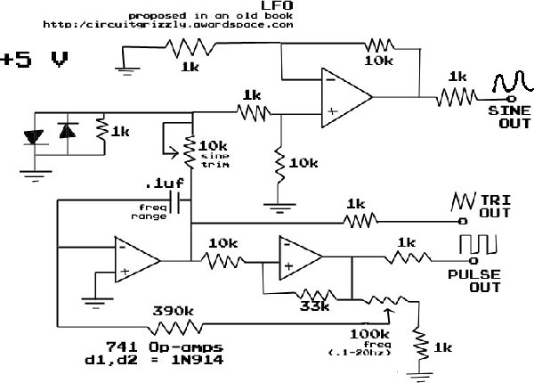

# Johansen Engineering KiCadJE_LFO_1
Initial Analogue LFO

# Purpose

# Status - PCB's being mounted
## Initial 
| Stage  | Detail | Status |
| ------------- | ------------- | ------------- |
| create material  | sch/pcb | OK  |
| | gerber | OK |
| production  |   | OK |
|  | produced | Yes |
|  | delivered | Yes |
## Preliminary validation
| Test  | Detail | Status |
| ------------- | ------------- | ------------- |
| Initial Inspection | | OK |
| Initial Technical Test | LFO555 | 555 and 072 gets warm in certain settings |
| Initial Product Test | LFO | Works well with R311 not mounted |
| | | Pot's should be 1 mm closer to front (or jacks further back)|
| Initial Product Test | LFO555 | Sine and Tri not working - RV101B should have 500R series resistor |
| Initial Product Test | MMX2 | Works nicely |
| Initial Product Test | NAND |  |
| Initial Product Test | FlipFlop | Working |

## Secondary validation
| Test  | Detail | Status |
| ------------- | ------------- |------------- |
| Product Test | LFO | |
| Product Test | LFO555 | not working right |
| Product Test | MMX2 | Working as intended |
| Product Test | NAND |  |
| Product Test | FlipFlop | Working as intended except for LED's |
| Quality | LFO | Sounds nice - a few constraints on pot's would be nice|
| Quality | LFO555 | |
| Quality | MMX2 | |
| Quality | NAND | |
| Quality | FlipFlop | |
| Long Term Product Test |  |  |
| Power Draw |  | 

## Errata
### Errata - LFO555
1 - SW101 too close to P101
### Errata - MMX2
1 - 1206 caps (C201+C202) are too close to the switch to mount both
### Errata - Flip-Flop
1 - LED positions swapped

## Issues and Notes
### LFO
1 - 100k should not be mounted (it ruins feedback)

2 - Sine pot should have 2k series resistor

3 - C303 could be 100nF and 1uF addon with a switch for high low

4 - Frequency pot is sensitive at low freq

5 - Chose different Jacks

6 - Consider adding series resistor to outputs

7 - mounting holes

8 - Pot's should be 1 mm closer to front (or jacks further back)

### 555 LFO
1 - RV101B should have series resistor (330 - 1k)

2 - All outputs should have a series resistor (470R ?)

3 - Pot's should be 1 mm closer to front (or jacks further back)

4 - RV101 footprint not matching pots

### Flip-Flop
1 - LED positions swapped

# Pictures

# Inspiration from 
https://www.electronics-tutorials.ws/waveforms/555_oscillator.html

http://electro-music.com/forum/topic-31166.html

